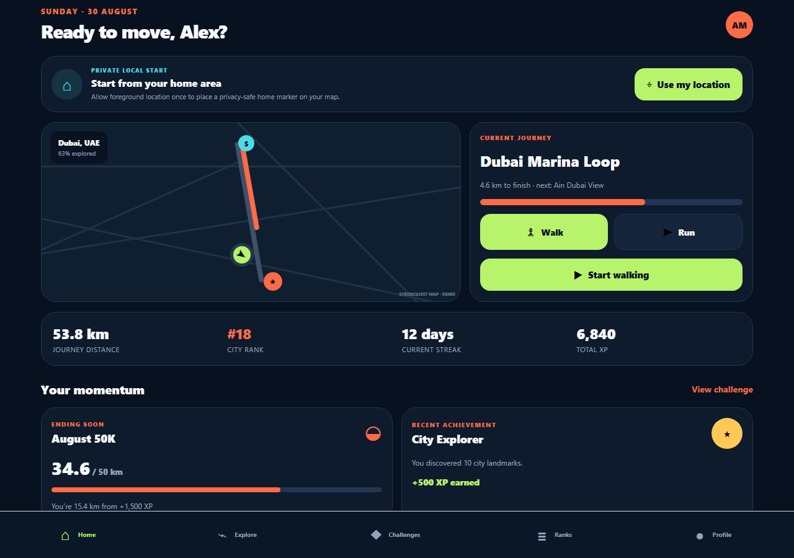
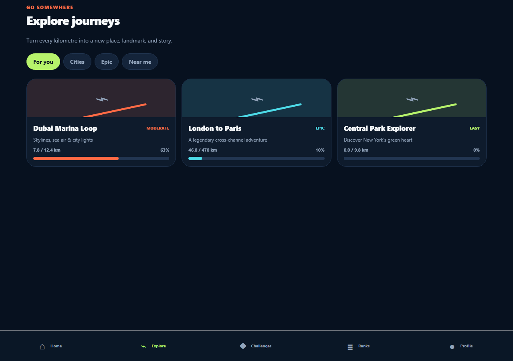
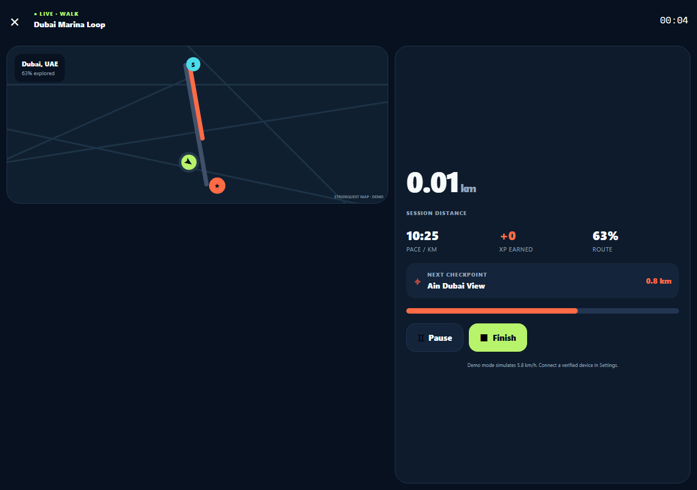
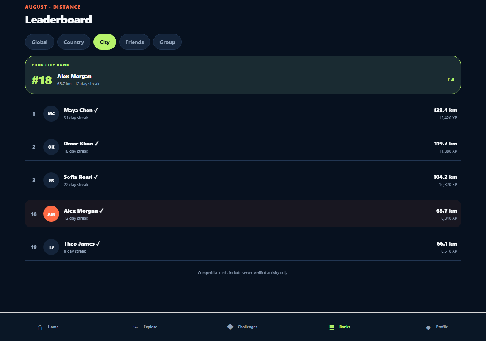

# StrideQuest

**Walk. Run. Explore. Compete.**

A cross-platform Expo MVP that turns physical activity into progress through real-world journeys. The initial build is intentionally keyless: its map-provider boundary renders a polished local route visualization so the complete product loop can be evaluated without credentials.

## Screenshots

| Home dashboard | Journey explorer |
| --- | --- |
|  |  |

| Live activity | Leaderboard |
| --- | --- |
|  |  |

## Run locally

Requirements: Node.js LTS and npm.

1. Install dependencies with `npm install`.
2. Start Expo with `npm start`.
3. Press `a` for Android, `i` for iOS (macOS), or `w` for web. A physical phone can open the development QR code with Expo Go when the installed Expo SDK is supported.

Validation commands:

- `npm run typecheck`
- `npm test`
- `npm run check`

## Included MVP experience

- Responsive phone/tablet dashboard with a map-first layout
- Permission-gated, foreground-only approximate home-area marker that stays private on-device
- Walking/running selection and simulated live session controls
- Route progress, pace, elapsed time, checkpoints, XP, and completion summary
- Durable local journey progress, XP, and activity history
- Journey discovery and detail views
- Challenges and challenge details
- Switchable leaderboard scopes with verification status
- Profile, achievements, friends, groups, history, notifications, privacy, device, health, export, and deletion flows
- Typed provider contracts for activity sensors, maps, health systems, and server-side validation
- Unit tests for distance-to-route progress, interpolation, XP, pace rollover, and checkpoint rules

Demo activity advances at a fixed simulated speed. It is clearly marked unverified and never represents production sensor data.

## Architecture

- `app/`: Expo Router screens and navigation
- `src/components/`: reusable visual system and keyless route renderer
- `src/domain/`: platform-independent models and movement/XP engine
- `src/services/`: provider interfaces for maps, sensors, health, and validation
- `src/state/`: persistent local session, journey, XP, and history state
- `src/data/`: seeded demo content

The activity engine accepts physical distance and produces normalized route progress independently of rendering. A production map adapter can replace the demo renderer without changing journey or activity logic. Competitive data must be uploaded as timestamped samples and validated by a backend; the client is never the source of truth.

## Production next steps

1. Add OIDC authentication and a consent-first onboarding flow.
2. Implement a backend for profiles, sessions, journey/challenge progress, groups, and notifications.
3. Add an event-driven leaderboard pipeline with idempotent activity ingestion.
4. Implement native GPS/background recording, Apple Health, Health Connect, and BLE adapters.
5. Select and integrate a licensed map/route provider behind `MapProvider`.
6. Persist offline samples in an encrypted local queue with conflict-safe synchronization.
7. Run server-side anti-cheat scoring using multiple signals and a human-review workflow.
8. Add localization, screen-reader audits, push notification preferences, E2E tests, and device battery testing.

## Privacy and safety boundaries

No precise physical location is shared by this prototype. Live social positions are intended to represent virtual route progress only. Production must collect minimum required data, encrypt transport and sensitive storage, support export/deletion, and provide granular profile, activity, leaderboard, and location controls.
